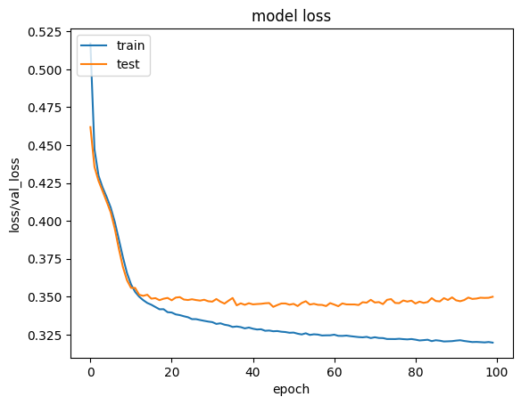
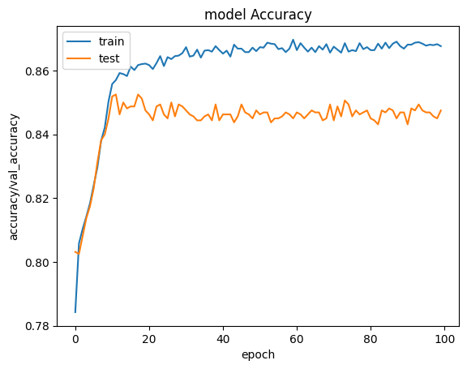

# 🧠 Credit Card Customer Churn Using ANN (Artificial Neural Network)

This project demonstrates how to build and train an **Artificial Neural Network (ANN)** from scratch using **TensorFlow/Keras** to predict whether a **credit card customer will churn (leave the bank)** based on their profile data.

---

## 🎯 Main Learning Purpose

> The **primary goal** of this project is to **understand how an ANN works**, not just to achieve high accuracy.
>
> You'll learn how data moves through:
> - **Forward propagation**
> - **Activation functions**
> - **Weight updates via backpropagation**
> - And how to improve or ruin model performance with architecture and training tweaks

---

## 💡 What This Project Does

This project walks you through the **complete machine learning pipeline**:

1. 📥 **Loads a dataset** of 10,000 bank customers with features like age, credit score, salary, etc.
2. 🧹 **Preprocesses the data** by:
   - Dropping unnecessary columns
   - Encoding categorical data
   - Scaling numerical features
3. 🧠 **Builds an ANN** with:
   - 1 hidden layer (3–6 neurons, ReLU)
   - 1 output layer (Sigmoid for binary classification)
4. 🧪 **Trains the ANN** using:
   - `binary_crossentropy` loss
   - `adam` optimizer
   - 10 to 100 epochs
5. 📊 **Displays accuracy and loss graphs** for both training and validation sets
6. 🧪 **Experiments** with architecture changes to observe how they affect learning
7. ⚠️ **Discusses overfitting** and what causes it

---

## 📊 Project Overview

- 🧠 **Type**: Binary Classification  
- 📁 **Data**: 10,000 records with 14 features  
- 🎯 **Target**: `Exited` column (1 = churn, 0 = not churn)  
- ⚙️ **Frameworks**: TensorFlow + Keras  
- 🎓 **Focus**: Educational — learn internals of ANN

---

## 🧼 Preprocessing Steps

1. 🗑️ **Drop Columns**: `RowNumber`, `CustomerId`, `Surname`
2. 🧠 **One-Hot Encoding**: `Geography`, `Gender`
3. ⚖️ **Feature Scaling**: Normalized numerical columns using `StandardScaler`

---

## 🎯 Improving Model Accuracy

| Change                    | Why it helps                                   |
|---------------------------|------------------------------------------------|
| 🔧 ReLU Activation         | Avoids vanishing gradients                     |
| ➕ More Neurons / Layers   | Allows model to learn more complex patterns    |
| 🔁 More Epochs (up to 100) | Helps model train longer to improve accuracy   |

---

## ⚠️ Overfitting Discussion

| Topic         | Explanation                                                                 |
|---------------|-----------------------------------------------------------------------------|
| ❗ What is it? | When a model memorizes training data but fails to generalize                |
| 🔍 Symptoms    | Training accuracy ↑, validation accuracy ↓ or stagnant                     |
| 🧪 In This Project | Appeared with more epochs/layers without regularization                 |
| 🧰 Fix (Future) | Add Dropout, EarlyStopping, reduce complexity                             |

---

## 📉 Model Loss Plot

Visual representation of **training vs validation loss**:

---

## 📈 Model Accuracy Plot

Visual representation of **training vs validation accuracy**:

---

## 📬 Summary

By the end of this project, you’ll understand:

- 🔍 How forward and backward propagation work in ANN
- ⚙️ How tuning neurons, layers, and epochs affects learning
- 📈 How to monitor performance using loss/accuracy graphs
- ⚠️ How overfitting happens and how to detect it

---

> 💬 **Learning is my hobby**  
> 😄 “Others play games to unwind — I play with neural networks. Watching loss go down is my version of Netflix!”

---

## 👨‍💻 Author

**Anwar Zahid**  
📧 your.email@example.com  
🌐 GitHub: [YourGitHubUsername](https://github.com/YourGitHubUsername)

---
